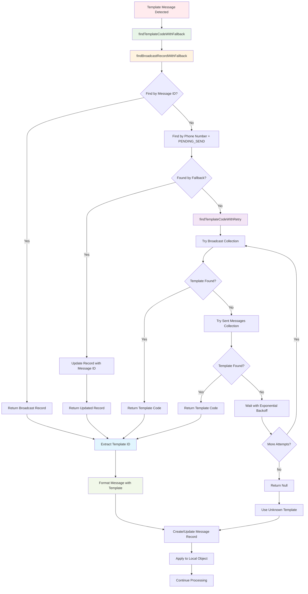
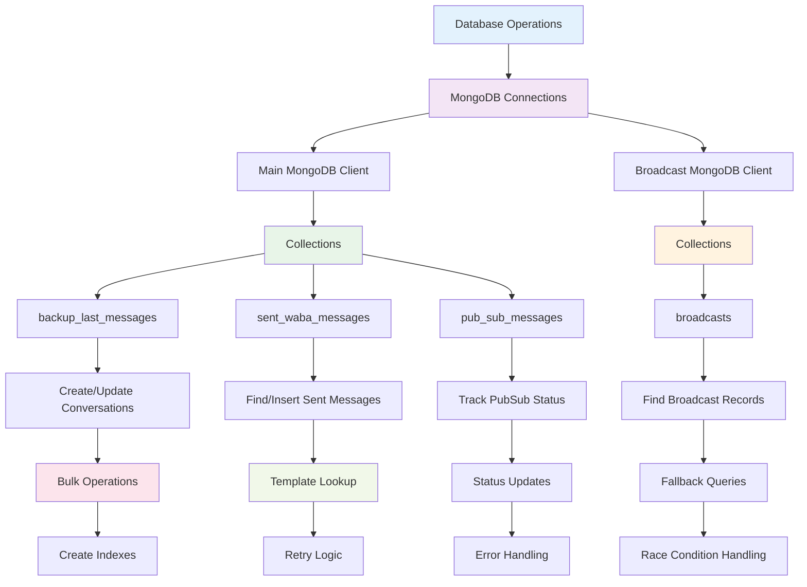
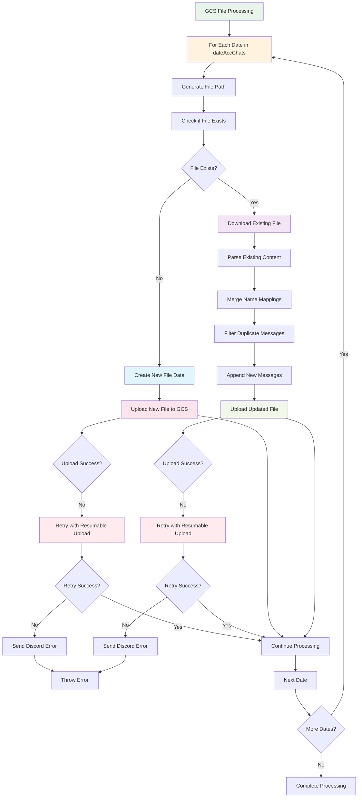
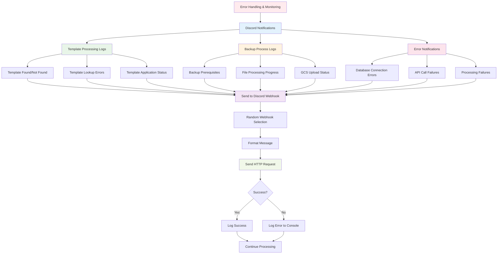

# GCS Backup Webhook Processor - Complete Flowchart

## Main Processing Flow

```mermaid
flowchart TD
    A[Webhook Request Received] --> B[webhookProcessor Function]
    B --> C[Extract Request Body & Start Timer]
    C --> D[Call mainEngine Function]
    
    D --> E[Extract Event Data from Request]
    E --> F{Check if Pub/Sub Envelope?}
    F -->|Yes| G[Decode Base64 Data]
    F -->|No| H[Use Raw Body]
    G --> H
    
    H --> I[detectingAndModifyingDataFormat]
    I --> J{Data Format Already Correct?}
    J -->|Yes| K[Return Data As-Is]
    J -->|No| L[Check for Send Format]
    
    L --> M{Is Send Format?}
    M -->|Yes| N[checkForSendFormat]
    M -->|No| O[Check for Reply Format]
    
    N --> P[Process Outgoing Message]
    P --> Q[Find Message in MongoDB]
    Q --> R{Message Found?}
    R -->|No| S[Try Fallback Queries]
    R -->|Yes| T[Extract Template Code]
    
    S --> U{Found by Phone Numbers?}
    U -->|Yes| T
    U -->|No| V[Create New Message Record]
    
    T --> W[Apply Template Processing]
    W --> X[Format Message Object]
    
    O --> Y{Is Reply Format?}
    Y -->|Yes| Z[checkForReplyFormat]
    Y -->|No| AA[Return Null]
    
    Z --> BB[Process Incoming Message]
    BB --> CC[Format Reply Object]
    
    X --> DD[Check PubSub Message Status]
    CC --> DD
    K --> DD
    
    DD --> EE{Message Already Processed?}
    EE -->|Yes| FF[Return Status]
    EE -->|No| GG[Insert New PubSub Record]
    
    GG --> HH[Validate Required Fields]
    HH --> II{All Fields Present?}
    II -->|No| JJ[Return False]
    II -->|Yes| KK[Validate Backup Prerequisites]
    
    KK --> LL{Prerequisites Met?}
    LL -->|No| MM[Send Discord Error & Return False]
    LL -->|Yes| NN[Check WABA Connection Status]
    
    NN --> OO{Phone Connected to WABA?}
    OO -->|Yes| PP[Skip Backup Process]
    OO -->|No| QQ[Proceed with Backup]
    
    QQ --> RR[Create dateAccChats Object]
    RR --> SS[Query Last Messages from MongoDB]
    SS --> TT[Filter New Messages Only]
    
    TT --> UU[Process BigQuery Data]
    UU --> VV[Create/Update Last Messages]
    VV --> WW[Process Files for GCS]
    
    WW --> XX[For Each Date in dateAccChats]
    XX --> YY{File Exists in GCS?}
    YY -->|No| ZZ[Create New File]
    YY -->|Yes| AAA[Download Existing File]
    
    ZZ --> BBB[Upload to GCS]
    AAA --> CCC[Merge with Existing Data]
    CCC --> DDD[Upload Updated File]
    
    BBB --> EEE[Update Sync Time]
    DDD --> EEE
    
    EEE --> FFF[Send Success Response]
    PP --> FFF
    
    FF --> GGG[Update PubSub Status]
    FFF --> GGG
    JJ --> GGG
    MM --> GGG
    
    GGG --> HHH[Return HTTP Response]
    
    style A fill:#e1f5fe
    style B fill:#f3e5f5
    style D fill:#e8f5e8
    style I fill:#fff3e0
    style N fill:#fce4ec
    style Z fill:#f1f8e9
    style UU fill:#e3f2fd
    style VV fill:#f9fbe7
    style WW fill:#fff8e1
```

## Template Processing Flow (Detailed)

## Database Operations Flow

## GCS File Processing Flow

## Error Handling & Monitoring Flow

## Key Components Summary

### 1. **Entry Point**: `webhookProcessor`
- Receives HTTP requests
- Calls `mainEngine` for processing
- Handles response formatting

### 2. **Main Engine**: `mainEngine`
- Extracts and validates event data
- Manages PubSub message tracking
- Orchestrates the entire backup process

### 3. **Data Format Detection**: `detectingAndModifyingDataFormat`
- Checks if data is already in correct format
- Routes to send/reply format processors
- Returns standardized data structure

### 4. **Send Format Processing**: `checkForSendFormat`
- Handles outgoing WhatsApp messages
- Complex template processing with fallbacks
- Creates message records in MongoDB

### 5. **Reply Format Processing**: `checkForReplyFormat`
- Handles incoming WhatsApp messages
- Simpler processing (no templates)
- Creates reply message objects

### 6. **Template Processing**
- Multi-step fallback system
- Broadcast collection lookup
- Retry logic with exponential backoff
- Race condition handling

### 7. **Database Operations**
- MongoDB connections (main + broadcast)
- Bulk operations for performance
- Index management
- Status tracking

### 8. **GCS File Processing**
- Date-based file organization
- Duplicate message filtering
- Resumable uploads with retry logic
- Error handling and monitoring

### 9. **BigQuery Integration**
- Processes chat data for analytics
- Runs in parallel with file processing
- Error handling without blocking main flow

### 10. **Monitoring & Logging**
- Discord webhook notifications
- Comprehensive error tracking
- Progress monitoring
- Performance metrics

This system handles WhatsApp Business API webhooks, processes both incoming and outgoing messages, manages template messages with complex fallback logic, stores data in MongoDB and GCS, and provides comprehensive monitoring through Discord notifications.
